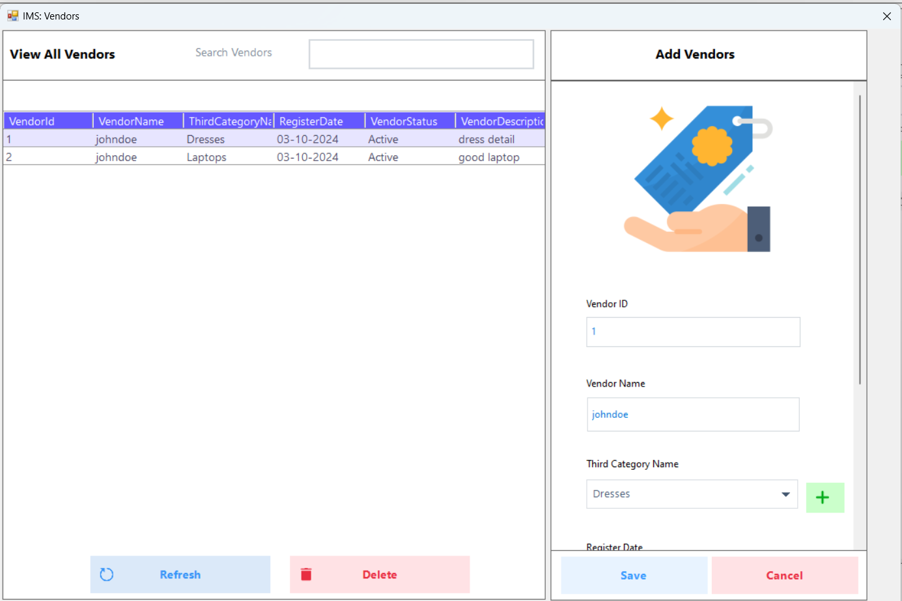

# � Inventory Management System 

<div align="center">
  
 
  
 


</div>

## 📌 Overview
**A complete retail solution** with:  
⚡ Real-time POS | 📦 Inventory Control | 👥 Employee Management | 📊 Advanced Analytics  

---

## ✨ Key Features

### 👨‍💼 Role Matrix
| Role        | Key Permissions                          |
|-------------|------------------------------------------|
| 🧑‍💼 **Admin**   | Full system control + Reports + HR       |
| 💰 **Cashier**  | POS + Bills + Stock Updates              |
| 🛒 **Salesman** | Sales + Encrypted Transactions           |

### 🛍️ Core Modules
| Module               | Features                                |
|----------------------|-----------------------------------------|
| 📊 **Dashboard**     | Real-time sales analytics               |
| 🏷️ **POS Terminal**  | Barcode support + Receipt printing      |
| 📦 **Inventory**     | Low stock alerts + Batch management     |
| 👥 **HR Management** | Attendance + Salary tracking            |
| 🔒 **Security**      | Caesar cipher encryption (300+ bits)    |

---

## 🛠️ Tech Stack
```diff
+ Frontend: Windows Forms + DevExpress + Guna UI2
+ Backend: C# (.NET 4.8) + Dapper ORM
+ Database: MS SQL Server 2022 (Stored Procedures)
+ Tools: SSMS + Visual Studio 2022
```
### 🚀 Quick Start
## 📥 Prerequisites
Visual Studio 2022

.NET 4.8 Runtime

SQL Server 2022

## ⚡ Setup
bash
# Clone repo
git clone https://github.com/shiva24082/Inventory-Management-System.git

# Restore database
1. Open SSMS → Restore MS_DB.bak
2. Update connection string in App.config

# Run application
1. Open MS.sln
2. Ctrl+Shift+B to build
3. F5 to run

## 🖼️ UI Preview
<div align="center">
   
   
   
   
   
   
   
   
   
   
   
   
   
   
   
   
   
   
   
   
   
   
   
   
   
</div>

